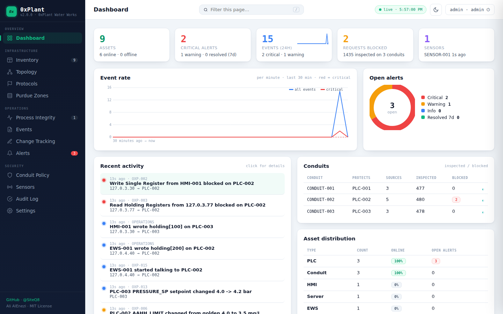
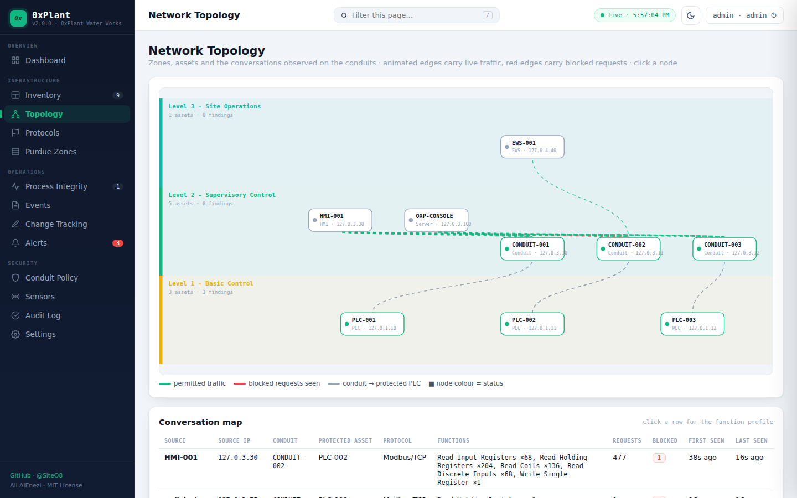
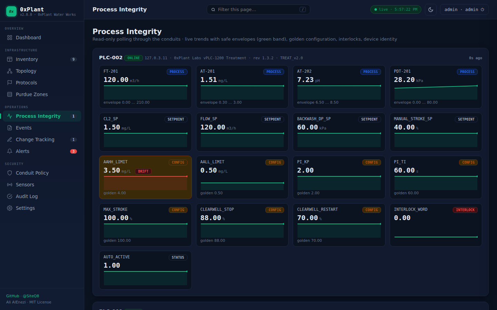
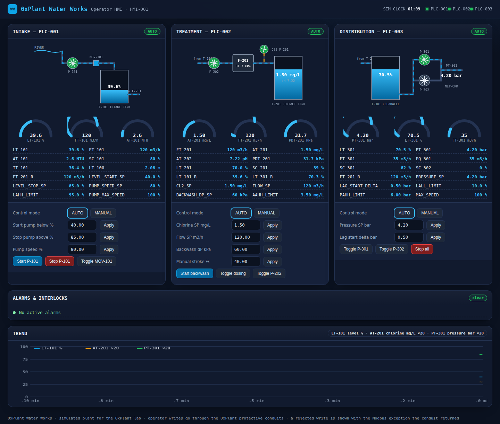

<div align="center">


<br>

[](LICENSE)
[]()
[]()
[]()

### Manage and protect your plant floor like you manage your cloud.

**Open source ICS/OT security: a real (simulated) water treatment plant, protected by 0xPlant.**

[Live Demo](https://siteq8.github.io/0xPlant) · [Quick Start](#quick-start) · [The Plant](#the-plant) · [0xPlant](#0xplant-the-security-tool) · [Detection Rules](#detection-rules) · [Verify the Controls](#verify-the-controls)

</div>

---

## What is 0xPlant

0xPlant is an open source security platform for ICS/OT networks. Version 2 ships two things in one repository:

1. **A real ICS plant** — *0xPlant Water Works*, a water treatment plant with three soft PLCs speaking genuine Modbus/TCP, a physical process model, safety interlocks, an operator HMI and an engineering workstation tool. Any Modbus client (pymodbus, Wireshark, your own tools) can talk to it.
2. **The 0xPlant security tool** that protects it — IEC 62443 conduits that inspect and allowlist every Modbus request into Level 1, asset discovery with device identification, a read-only process integrity monitor, alerting, change tracking with approval, an audited console with RBAC, and syslog/webhook forwarding to your SIEM.

**The name:** `0x` (hexadecimal prefix — because we speak in registers and opcodes) + `Plant` (the factory floor we protect).

```
 Level 3  ─────────────────────────────────────────────────────────────────────
           EWS-001 (engineering tool)          0xPlant CONSOLE  http://:8000
                     │ Modbus/TCP                  │ read-only integrity polls
 Level 2  ───────────┼─────────────────────────────┼────────────────────────────
           HMI-001 (operator screen) http://:8080  │
                     │ Modbus/TCP                  │
             ┌───────┴──────────┬──────────────────┴───┬──────────────────┐
             │ CONDUIT-001      │ CONDUIT-002          │ CONDUIT-003      │   0xPlant sensors:
             │ allowlist + DPI  │ allowlist + DPI      │ allowlist + DPI  │   default deny, per-source
             └───────┬──────────┴───────────┬──────────┴────────┬─────────┘   function codes & write ranges
 Level 1  ───────────┼──────────────────────┼───────────────────┼─────────────
              PLC-001 intake ◄──────► PLC-002 treatment ◄──────► PLC-003 distribution
              river pump, tank         filter, chlorine dosing    clearwell, high-lift pumps
```

---

## Screenshots

| 0xPlant console — dashboard | Network topology (live conduit traffic) |
|---|---|
|  |  |

| Process integrity (dark mode, live trends) | Operator HMI (animated P&ID) |
|---|---|
|  |  |

**Try it now:** the [live demo](https://siteq8.github.io/0xPlant) runs the real console code in your browser, replaying a dataset captured from an actual lab run (sign in as `admin`, `engineer`, `soc` or `operator` with `Plant@2025`; acknowledge alerts, approve changes, open drawers). The [operator HMI demo](https://siteq8.github.io/0xPlant/hmi.html) replays the plant the same way. Rebuild both from your own lab run with `python scripts/build_site.py`.

The console is a single page under a strict Content Security Policy with no external JavaScript: canvas charts, an SVG topology map with animated flows, detail drawers on every row, sortable and filterable tables (`/` focuses the filter), dark mode, and toasts for new critical alerts. The HMI shows an animated P&ID with running pumps, flowing pipes, tank levels, arc gauges, a trend with axes and an interlock banner.

---

## Quick Start

### Docker (recommended — real network segmentation)

```bash
git clone https://github.com/SiteQ8/0xPlant.git && cd 0xPlant
export OXPLANT_SENSOR_TOKEN=$(openssl rand -hex 24)     # shared secret between sensors and console
docker compose up --build
```

| Component | URL | Credentials |
|-----------|-----|-------------|
| 0xPlant console | http://localhost:8000 | `admin` / `Plant@2025` (also `engineer`, `soc`, `operator`) |
| Operator HMI | http://localhost:8080 | — |

Docker Compose creates three networks that mirror the Purdue model. `l1_control` (10.10.1.0/24) is `internal`, so the PLCs are reachable **only** through the sensor containers that run the conduits.

### Local (no Docker, everything on loopback)

```bash
pip install -r requirements.txt
python scripts/run_local.py
```

The local runner starts the three PLCs, the sensor (three conduits), the console and the HMI as child processes on `127.0.x.y` addresses that mirror the Docker layout. Stop with `Ctrl-C`. Linux answers on the whole `127.0.0.0/8` range out of the box; on macOS add the aliases first (`sudo ifconfig lo0 alias 127.0.1.10` and so on for the addresses in `config/*.local.yaml`), or use Docker.

### Change the default passwords

```bash
python -m oxplant hash-password      # paste the hash into config/oxplant.*.yaml under console.users
```

---

## The Plant

*0xPlant Water Works* is a coupled process simulation. Each PLC runs a scan cycle (250 ms) over its own section of the physics, publishes process values to Modbus tables, and reads what it needs from its neighbours over Modbus — real PLC-to-PLC traffic.

| PLC | Section | Control logic | Interlocks |
|-----|---------|---------------|------------|
| **PLC-001** Intake | River pump P-101, intake valve MOV-101, intake tank T-101 | Level control with start/stop setpoints, turbidity monitoring | LAHH tank high-high stops the pump (latched) |
| **PLC-002** Treatment | Transfer pump P-202, sand filter F-201, chlorine dosing pump P-201, contact tank T-201 | PI chlorine residual control, automatic filter backwash on differential pressure | AAHH chlorine high-high stops dosing (latched) |
| **PLC-003** Distribution | Clearwell T-301, high-lift pumps P-301/P-302, network pressure PT-301 | Pressure control with lead/lag pumps against a diurnal demand curve | LALL clearwell low-low and PAHH pressure high-high stop the pumps |
| **IoT layer** | MQTT broker (Level 2) and a fleet of vibration, bearing-temperature, ambient and gas sensors that follow the real pump states | Cleartext MQTT, as commonly found on plant floors | — |

Simulated time runs 60× faster than real time by default (`time_scale` in `config/plant.*.yaml`), so tanks fill and the demand curve moves within minutes.

### Register map

Every virtual PLC uses the same layout (zero-based Modbus addresses). `python -m plant tags` prints the full map.

| Table | Range | Content | Who may write (conduit policy) |
|-------|-------|---------|--------------------------------|
| Input registers (FC04) | 0–63 | Process values (levels, flows, chlorine, pressure, …) | nobody |
| Holding registers | 0–9 | Status words: mode, scan counter, interlock word, alarm word, uptime, simulated clock, remote link | nobody — the PLC rejects writes here |
| Holding registers | 100–119 | Operator setpoints | HMI and EWS |
| Holding registers | 200–219 | Engineering configuration: interlock limits, alarm limits, controller tuning | EWS only |
| Coils | 0–7 | Operator commands (auto/manual, start, stop, backwash) | HMI and EWS |
| Coils | 16–23 | Engineering commands (alarm reset) | EWS only |
| Discrete inputs | 0–15 | Running, alarm and interlock status bits | nobody |

The PLC also enforces engineering limits itself: an out-of-range setpoint is clamped and written back, so the HMI always shows the value actually in effect. Read Device Identification (FC 43/14) returns vendor, model, firmware revision and application name.

### Operator HMI and engineering tool

* **HMI** (`python -m plant hmi`) — live P&ID-style screen with tank levels, pumps, valves, alarms, a trend and operator controls. Writes go to the PLCs through the conduits; a blocked write is shown to the operator with the Modbus exception the conduit returned.
* **EWS tool** (`python -m plant ews`) — read, write and identify tags by name from the engineering workstation:

```bash
python -m plant -c config/plant.local.yaml ews --plc PLC-002 identify
python -m plant -c config/plant.local.yaml ews --plc PLC-002 read AT-201 CL2_SP AAHH_LIMIT
python -m plant -c config/plant.local.yaml ews --plc PLC-002 write AAHH_LIMIT=3.5
# Docker: docker compose exec ews python -m plant -c config/plant.docker.yaml ews --plc PLC-002 write AAHH_LIMIT=3.5
```

---

## 0xPlant: the security tool

### Protective conduits (`oxplant sensor`)

A conduit is a transparent Modbus/TCP gateway placed between the supervisory network and a PLC. Every frame is decoded and evaluated against the policy for its **source address** before it is forwarded:

* **Default deny** — hosts that are not in the policy get a Modbus exception and a critical alert (OXP-003).
* **Function-code allowlists** — `read`, `write`, `identification`, or explicit function codes per source.
* **Write-range protection** — the HMI may write setpoints (`holding 100-119`, `coils 0-7`) but not the engineering region; a write outside the ranges is refused with *Illegal Data Address* (OXP-002).
* **Rate limiting** — per-source request budgets; excess requests are answered with *Device Busy* (OXP-004).
* **Protocol validation** — frames that do not decode as Modbus/TCP drop the connection (OXP-011).
* **Availability** — an unreachable PLC is reported (OXP-016) and the client receives *Gateway Target Failed*.
* Every conversation is profiled (source, function codes, request and block counts) and shown on the console's Topology and Protocols pages.

```yaml
conduits:
  - id: CONDUIT-002
    asset: PLC-002
    listen:   {host: 10.10.3.11, port: 502}
    upstream: {host: 10.10.1.11, port: 502}
    default: deny
    max_rps: 60
    rules:
      - {asset: HMI-001,     allow: [read], writes: {holding: ["100-119"], coils: ["0-7"]}}
      - {asset: EWS-001,     allow: [read, write, identification]}
      - {asset: OXP-CONSOLE, allow: [read, identification]}
```

### Asset discovery

Sensors scan their Level 1 segment and the console scans Level 2/3 for ICS services (Modbus, S7comm, OPC UA, EtherNet/IP, DNP3, MQTT, BACnet, IEC 104) and legacy services (Telnet, FTP, HTTP, SMB). Modbus devices are identified with FC 43/14. Hosts not in the approved inventory raise OXP-009 and appear as *unapproved* until an engineer approves them; cleartext services raise OXP-010; assets that stop answering raise OXP-007.

### Process integrity monitor (console)

Read-only polling of every PLC through its conduit:

* **Safe envelopes** for process values (chlorine residual, tank levels, network pressure …) with debouncing (OXP-005).
* **Golden configuration** for engineering registers — any drift creates a *change record* awaiting review (OXP-006). Approving the change makes the new value golden and resolves the alert.
* **Setpoint changes** are logged for change tracking (OXP-013).
* **Interlock trips** reported by the PLC (OXP-012).
* **Device identity** snapshots — a changed vendor, model, firmware or application name is critical (OXP-008).

### Console (`oxplant console`)

* Dashboard, Inventory, Topology, Protocols, Purdue Zones, Process Integrity, Events, Change Tracking, Alerts, Conduit Policy, Sensors, Audit Log, Settings.
* **Authentication** with PBKDF2 password hashes, HttpOnly/SameSite session cookies, account lockout after 5 failures (OXP-014), CSRF protection, strict Content Security Policy, optional TLS (`console.tls`).
* **RBAC** — `admin` (everything), `engineer` (approve changes and assets), `soc` (acknowledge and resolve alerts), `viewer` (read-only).
* **Audit log** of logins, lockouts, denied actions, alert handling and change approvals.
* **Alert correlation** — repeated events update one alert instead of flooding the queue; alerts auto-resolve when the condition clears.
* **Outputs** — CEF over UDP syslog and JSON webhooks for events at or above a severity threshold.
* **REST API** — everything the UI shows is available as JSON under `/api/` (session cookie), and sensors report through `/api/ingest` with a bearer token.

### Command line

```bash
python -m oxplant -c config/oxplant.local.yaml policy-check   # validate configuration, print policies
python -m oxplant scan 10.10.1.0/24 --ports 502,102,4840      # one-off discovery
python -m oxplant -c config/oxplant.docker.yaml console
python -m oxplant -c config/oxplant.docker.yaml sensor --name SENSOR-001
python -m oxplant hash-password
```

---

## Research testbed

0xPlant is built to be used as a reproducible ICS security research platform. Everything below runs in the local lab with no extra dependencies.

| Capability | Where | What it gives you |
|---|---|---|
| **Fault injection** | `plant/faults.py`, HTTP API on each PLC (`sim_port`) | Stuck/offset/noisy sensors, actuator failures, PLC link loss, communication blackouts, firmware identity changes: `curl -X POST 127.0.0.1:9001/fault -d '{"type":"sensor_stuck","tag":"LT-101","duration_s":60}'` |
| **Physics invariants** | `oxplant/invariants.py`, `integrity.targets[].invariants` | Safe expression language over process tags (mass balances, actuator/flow consistency). Reported values that contradict the physics raise OXP-018: false data injection and frozen sensors are caught even when every value is inside its envelope |
| **Behavioural baselining** | `oxplant/baseline.py`, `sensors[].learning_s` | Conduits learn each source's request patterns and rate, then report deviations (OXP-017) on top of the allowlist |
| **Labelled traffic dataset** | `sensors[].record` → JSONL | Every request with its policy decision, rule, exception and latency ([schema](docs/research/dataset.md)) |
| **IoT layer** | `plant/mqtt.py`, `plant/iot.py`, `oxplant/mqttmon.py` | Dependency-free MQTT broker, condition-monitoring sensor fleet, and a monitor that baselines topics, publishers and payload ranges (OXP-019/020) |
| **Metrics and exports** | `/metrics` (Prometheus), `/api/export/<kind>.csv` | Time series of process values, invariant state, alerts and conduit counters; tabular exports of everything the console stores |
| **Experiment harness** | `research/run_experiments.py` | 13 reproducible scenarios measuring detection latency per rule, with JSON and Markdown reports ([methodology](docs/research/methodology.md)) |

```bash
python research/run_experiments.py --list          # scenarios
python research/run_experiments.py --runs 3        # starts the lab, runs every scenario 3 times, writes research/results/
```

Documentation: [architecture](docs/research/architecture.md) · [threat model](docs/research/threat-model.md) · [methodology](docs/research/methodology.md) · [dataset](docs/research/dataset.md). Cite with [CITATION.cff](CITATION.cff).

---

## Detection rules

| Rule | Title | Severity | Reference |
|------|-------|----------|-----------|
| OXP-001 | Unauthorized protocol function | critical | IEC 62443-3-3 SR 5.2, ATT&CK ICS T0855 |
| OXP-002 | Write outside permitted range | critical | IEC 62443-3-3 SR 3.8, ATT&CK ICS T0836 |
| OXP-003 | Unknown source on conduit | critical | IEC 62443-3-3 SR 1.2, NIST SP 800-82 |
| OXP-004 | Request rate anomaly | warning | ATT&CK ICS T0814 |
| OXP-005 | Process value outside safe envelope | critical | IEC 61511 |
| OXP-006 | Configuration drift from golden baseline | warning | IEC 62443-2-1, NERC CIP-010 |
| OXP-007 | Asset offline | warning | IEC 62443-3-3 SR 7.1 |
| OXP-008 | Device identity changed | critical | NERC CIP-010, ATT&CK ICS T0857 |
| OXP-009 | Rogue device discovered | critical | IEC 62443-2-1, NIST SP 800-82 |
| OXP-010 | Insecure service exposed | warning | IEC 62443-3-3 SR 4.1 |
| OXP-011 | Malformed protocol frame | warning | ATT&CK ICS T0868 |
| OXP-012 | Safety interlock tripped | critical | IEC 61511 |
| OXP-013 | Operator setpoint change | info | IEC 62443-2-1 |
| OXP-014 | Console authentication failure | warning | IEC 62443-3-3 SR 1.11 |
| OXP-015 | New conversation observed | info | NIST SP 800-82 |
| OXP-016 | Upstream device unreachable | warning | IEC 62443-3-3 SR 7.1 |
| OXP-017 | Behavioural anomaly on conduit | warning | NIST SP 800-82, ATT&CK ICS T0846 |
| OXP-018 | Process invariant violated | critical | IEC 61511, ATT&CK ICS T0832/T0856 |
| OXP-019 | Unexpected MQTT publisher or topic | warning | IEC 62443-3-3 SR 1.2 |
| OXP-020 | IoT telemetry anomaly | warning | IEC 62443-3-3 SR 3.5 |

---

## Verify the controls

All of these run against your own lab and are exercised by the test-suite.

1. **Engineering change with approval** — from the EWS run `ews --plc PLC-002 write AAHH_LIMIT=3.5`. The console shows an OXP-006 alert and an *unreviewed* change record. Approve it with a CAB ticket: the value becomes golden and the alert resolves.
2. **Write-range protection** — on the HMI the engineering limits are not editable; the HMI backend refuses them, and even a direct Modbus write from the HMI address to holding register 200 is answered by the conduit with *Illegal Data Address* (OXP-002).
3. **Unlisted host** — connect any Modbus client from an address that is not in the policy (locally: bind to `127.0.3.77`): every request is refused and OXP-003 is raised once per source.
4. **Process envelope** — lower the chlorine setpoint on the HMI until the residual falls below 0.3 mg/L: OXP-005 after three consecutive polls, auto-resolved when it recovers.
5. **Availability** — stop a PLC container: the conduit reports OXP-016, the integrity monitor OXP-007; both resolve when it returns.
6. **Console hardening** — five wrong passwords lock the account and raise OXP-014; a viewer cannot acknowledge alerts; POSTs without the `X-Requested-With` header are refused.

---

## Configuration reference

| File | Purpose |
|------|---------|
| `config/plant.local.yaml`, `config/plant.docker.yaml` | PLC definitions (program, listen address, identity, remote links), HMI targets, time scale |
| `config/oxplant.local.yaml`, `config/oxplant.docker.yaml` | Console (users, TLS, outputs), zones, approved assets, conduits and policies, sensors, discovery scopes, integrity targets (tags, envelopes, golden values) |
| `docker-compose.yml` | The segmented lab |
| `scripts/build_site.py` | Runs the local lab, captures console and HMI data, and builds the GitHub Pages demo in `docs/` |

`${ENV_VAR}` references in the 0xPlant configuration are expanded from the environment (used for the sensor token).

---

## Project layout

```
modbuslite/   dependency-free Modbus/TCP codec, server and client (shared by plant and 0xPlant)
plant/        the water works: PLC programs & physics, soft-PLC runtime, HMI, EWS tool, fault injection, MQTT broker, IoT fleet
oxplant/      the security tool: policy, conduit, baseline, discovery, integrity, invariants, mqtt monitor, store, console, outputs, auth
research/     experiment harness and results
config/       local and Docker configurations
scripts/      run_local.py
tests/        pytest suite (includes pymodbus interoperability)
docs/         GitHub Pages live demo (built by scripts/build_site.py from the real UI + captured data)
```

## Testing

```bash
pip install -r requirements-dev.txt
pytest
```

---

## Roadmap

* Additional protocol conduits: S7comm, OPC UA, EtherNet/IP, DNP3
* Passive (SPAN/TAP) sensor mode
* PLC program (logic) backup and golden image comparison

## License

MIT — see [LICENSE](LICENSE).

---

<div align="center">
  <sub>0xPlant — ICS/OT/IoT Security</sub><br>
  <sub><a href="https://github.com/SiteQ8">@SiteQ8</a> — Ali AlEnezi</sub>
</div>
