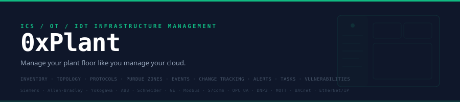

<div align="center">



<br>

[](LICENSE)
[]()
[]()
[]()

### Manage your plant floor like you manage your cloud.

**ICS/OT/IoT Infrastructure Management Platform**

[Live Demo](https://siteq8.github.io/0xPlant) · [Modules](#modules) · [Quick Start](#quick-start)

</div>

---

## What is 0xPlant

0xPlant is an enterprise management platform for ICS, OT, and IoT infrastructure. Instead of managing VMs and containers, you manage PLCs, RTUs, HMIs, DCS, safety systems, switches, and IoT sensors.

**The name:** `0x` (hexadecimal prefix — because we speak in registers and opcodes) + `Plant` (the factory floor we protect). Geeky by design.

---

## Demo Access

| Username | Password |
|----------|----------|
| `admin` | `Plant@2025` |

**Live:** [https://siteq8.github.io/0xPlant](https://siteq8.github.io/0xPlant)

---

## Modules

| Module | Description |
|--------|-------------|
| **Dashboard** | Overview: 2,461 assets, distribution by type (10 asset categories), recent activity feed |
| **Inventory** | Full asset table: 12 demo assets from Siemens, Rockwell, Yokogawa, Schneider, GE, ABB, AVEVA, OSIsoft, Palo Alto, Hirschmann |
| **Topology** | Protocol connection map: 8 protocols with connection counts, zone flows, anomaly detection |
| **Protocols** | 9 ICS protocol cards: Modbus, S7comm, OPC UA, EtherNet/IP, DNP3, MQTT, BACnet, IEC 104, TriStation |
| **Purdue Zones** | ISA/IEC 62443 zone model (L0-L5 + DMZ) with health status per zone |
| **Events** | Real-time event log with timestamps, source IPs, and rule references |
| **Change Tracking** | Configuration audit: CAB approval references, unauthorized changes flagged |
| **Alerts** | Active alerts: critical/warning/info with severity badges and status |
| **Task Center** | Patching schedules, investigations, pen tests with assignees and due dates |
| **Vulnerabilities** | 6 real CVEs matched to inventory with CVSS scores and remediation status |
| **Compliance** | 6-framework compliance tracking (IEC 62443, NIST 800-82, NERC CIP, ATT&CK, CIS, CISA). Gap analysis with risk owner and target dates |
| **Audit Log** | Immutable event trail: 14,823 events, user actions, auth failures, config changes, denied actions — 365-day retention |
| **Users & RBAC** | 24 users, 5 roles (Admin, Engineer, SOC, Operator, Vendor). Full permissions matrix. MFA enforcement (TOTP/FIDO2). Account lockout |
| **Backups** | Automated daily backups: PLCs, RTUs, switches, golden images. 3-2-1 rule, AES-256 encryption, air-gapped copy, quarterly restore testing |
| **Reports** | 8 scheduled reports: executive summary, vulnerability status, compliance gaps, asset inventory, remote access audit, patch compliance, IEC 62443 audit package, incident summary |
| **Integrations** | 8 connected platforms: Splunk SIEM, ServiceNow ITSM, CrowdStrike EDR, Azure AD SSO, Palo Alto Panorama, Tenable.ot, PagerDuty, Jira. REST API, Syslog, SNMP, Webhooks, SAML, LDAP |
| **Settings** | Discovery, alerts, SIEM forwarding, golden image drift, rogue device detection, protocol baselines |

---

## Supported Vendors & Protocols

### Vendors
Siemens · Allen-Bradley/Rockwell · Yokogawa · Schneider Electric · GE · ABB · AVEVA · OSIsoft · Palo Alto · Hirschmann · Johnson Controls · Eclipse Mosquitto · Moxa

### Protocols
| Protocol | Port | Standard |
|----------|------|----------|
| Modbus/TCP | 502 | IEC 61158 |
| S7comm+ | 102 | Siemens |
| OPC UA | 4840 | IEC 62541 |
| EtherNet/IP | 44818 | IEC 61158 |
| DNP3 | 20000 | IEEE 1815 |
| MQTT | 1883 | ISO 20922 |
| BACnet/IP | 47808 | ISO 16484-5 |
| IEC 60870-5-104 | 2404 | IEC 60870 |
| TriStation | 1502 | Schneider |

---

## Quick Start

### Online
**[https://siteq8.github.io/0xPlant](https://siteq8.github.io/0xPlant)**

### Local
```bash
git clone https://github.com/SiteQ8/0xPlant.git
cd 0xPlant && open docs/index.html
```

Login: `admin` / `Plant@2025`

---

## Design

**Sidebar navigation** with persistent left panel for rapid context-switching. Clean light content area with dark navy sidebar. Fira Code mono for technical data, Source Sans 3 for body text. Emerald green (`#10B981`) accent.

**17 pages** organized into 4 sections:
- **Infrastructure:** Inventory, Topology, Protocols, Purdue Zones
- **Operations:** Events, Change Tracking, Alerts, Task Center
- **Security:** Vulnerabilities, Compliance, Audit Log
- **Enterprise:** Users & RBAC, Backups, Reports, Integrations, Settings

---

## License

MIT — see [LICENSE](LICENSE).

---

<div align="center">
  <sub>0xPlant — ICS/OT/IoT Infrastructure Management</sub><br>
  <sub><a href="https://github.com/SiteQ8">@SiteQ8</a> — Ali AlEnezi</sub>
</div>
